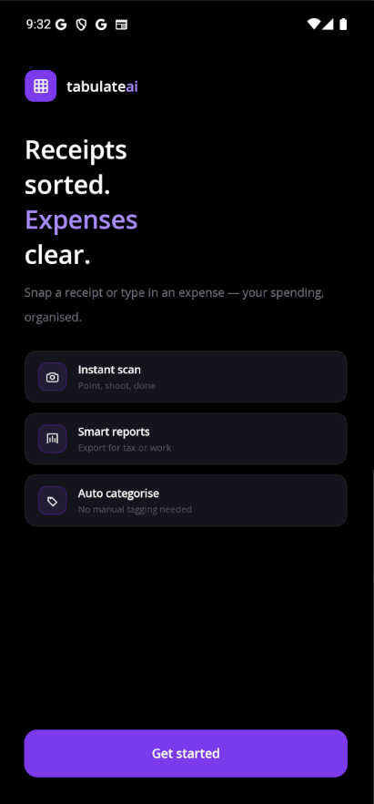
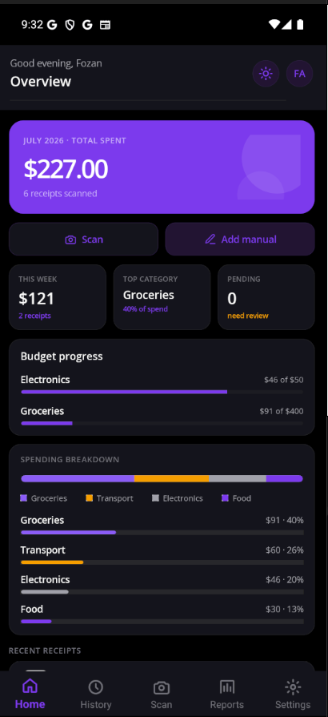
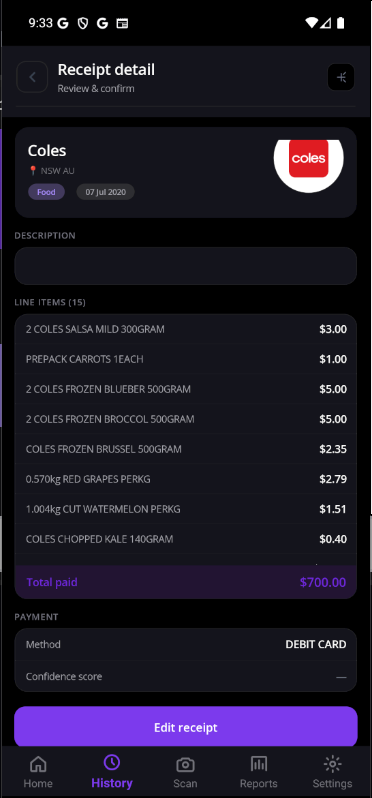
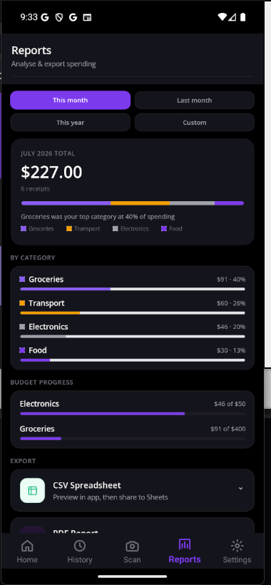

# TabulateAI

Snap a receipt. AI pulls out the details. Track your spending — all on your phone.

## Screenshots

| Welcome | Dashboard |
|:---:|:---:|
|  |  |

| Receipt detail | Reports |
|:---:|:---:|
|  |  |

## What you can do

- **Scan receipts** with your camera or pick one from your gallery
- **Let AI read it** — merchant, date, amount, and each line item are filled in for you
- **Review and edit** anything before saving
- **See your spending** on a dashboard with category breakdowns and monthly budgets
- **Search your history** and edit or delete past receipts
- **Export reports** as CSV or PDF, or email a report with the PDF attached
- **Set monthly budgets** per category and track how you're going
- **Light and dark mode**, plus backup & restore of your data

## Your data stays yours

Everything is stored **on your device** — there's no account to create and no sign-in. Your receipts and images never leave your phone unless you choose to export or email a report.

## Getting started

1. Open the app and tap the **camera** button
2. Point it at a receipt (or choose one from your gallery)
3. Wait a moment while the AI reads it
4. Check the details, pick a category, and **save**
5. Head to the **Dashboard** and **Reports** tabs to see your spending

## Tips

- Add your **name and email** in Settings so exported reports are personalised
- Set **monthly budgets** in Settings to get category tracking on your dashboard
- Use **Reports → Email report** to send a PDF (with receipt thumbnails) to yourself, your manager, or your accountant
